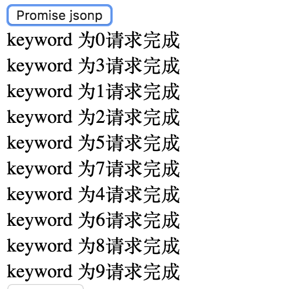

## 竞态请求

[stackblitz](https://stackblitz.com/edit/rxjs-race-jsonp?embed=1&file=index.ts)

在前端中经常处理请求，现在有需求: 每 10ms 请求一次百度搜索关键词，请求十个，然后显示出来。

在百度接口响应速度响应时间小于 10ms 的时候这样是没有问题的，但是这个接口响应时间在 80ms 左右，那么就会出现竞态。因为请求是异步的，只能保证发送请求的顺序是固定的，但是不能保证返回响应的顺序是一定的。可能出现**先发送的请求后响应的情况**

比如

但是 rxjs jsonp 就不会，因为 `switchMap` 会把在进行中的网络请求取消，在 10ms 后发现没有响应回来，就会取消前一个请求的订阅发下一个请求。

> 注意，是取消前一个请求的订阅，不是取消前一个请求，请求是一定会发出去的。
