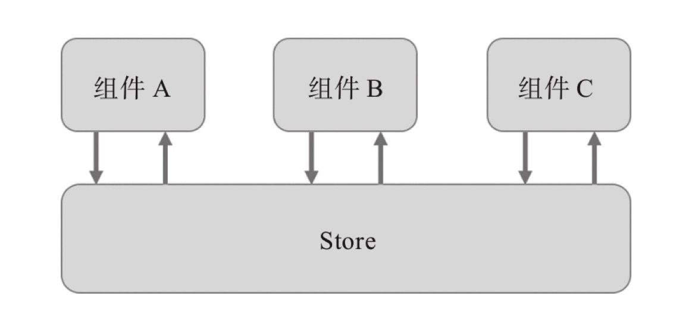
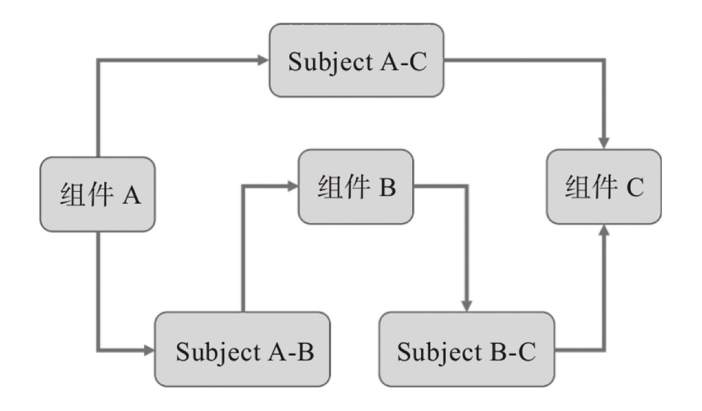

TODO

<!-- rxjs react demo: [stackblitz](https://stackblitz.com/edit/react-ts-qympt7)

## redux vs rxjs

如果每两个需要通信的组件之间建立一个独立通信，比如使用 rxjs 的 Subject 作为桥梁沟通组件，那么对应的程序状态管理如下:

为了支持每一对组件之间一个方向的通信，就需要创建一个 subject 对象，只不过为了支持 A -> B / B -> C / A -> C 的通信，就建立了 3 个 Subject 对象，在一个实际应用中需要通信的部分就会更多，容易造成 subject 对象太多管理不过来。 -->